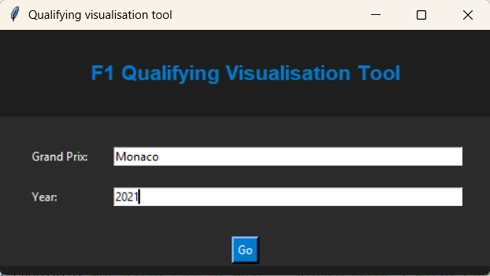
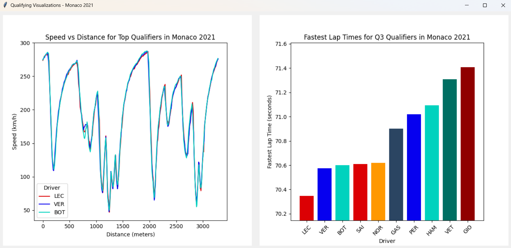

<h1> F1 Qualifying Visualisation Tool </h1>

An interactive Python app that visualises Formula 1 qualifying data using FastF1, Tkinter and Matplotlib.

It lets you select any Grand Prix and year, then displays:

- Speed vs Distance telemetry comparison for the top 3 qualifiers

- Lap times for all drivers in Q3

All wrapped in a simple GUI build in Tkinter.

<h3>Features:</h3>

  - Fetches live F1 session data from FastF1's API
 
  - Caches session data locally for faster reloads
 
  - Simple interactive UI built with Tkinter
 
  - Error handling for invalid races or years
 

<h3>Demo:</h3>

Dependencies: Python 3.9+, fastf1, matplotlib, pandas, numpy

<h3>How to run:</h3>

- Clone repo: git clone https://github.com/angel127127/f1Pitstops/

- cd fastf1QualifyingGraphs

- Enter a Grand Prix name and year (eg Monaco, 2021) and click Go

<h3>Challenges:</h3>

- Handling raw F1 data

- Ui embedding with Matplotlib

- Error handling

- Layout management

<h3>Future improvements:</h3>

- Include sector-by-sector analysis

- Add more graphs to dashboard, ie factoring in tyre compounds

- Add support for race sessions

Used [FastF1 Documentation](https://docs.fastf1.dev/) for development
