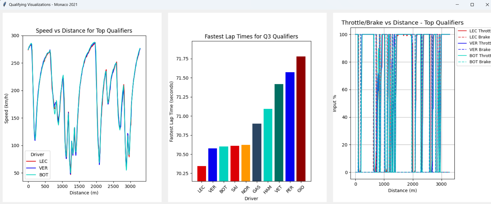
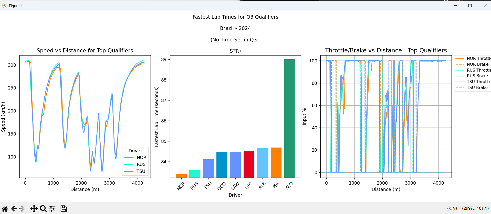

<h1> F1 Qualifying Visualisation Tool </h1>

A Python tool to fetch, process, and visualise F1 qualifying telemetry data using [FastF1](https://github.com/theOehrly/Fast-F1).  
Supports both GUI (Tkinter) and CLI usage.

It lets you select any Grand Prix and year, then displays:

- Speed vs Distance telemetry comparison for the top 3 qualifiers

- Lap times for all drivers in Q3

- The throttle and brake percentage applied across the fastest lap for top 3 qualifiers

<h3>Features:</h3>

- Speed vs Distance plots for top 3 qualifiers
  
- Fastest lap times for top 10 Q3 drivers, including handling missing laps

- Throttle/Brake input comparison graphs

- Caches data locally

- Logging for data processing and missing data detection

- Works in GUI and CLI

- Developed iteratively from Google Colab → Python script → GUI → CLI
 

<h3>Demo:</h3>
Tkinter:

Graph screen: 

CLI command: python cli.py Brazil 2024

Dependencies: Python 3.9+, fastf1, matplotlib, pandas, Tkinter, CLI via argparse, Cloud prototyping

<h3>Installation</h3>

git clone https://github.com/yourusername/f1QualifyingGraphs.git

cd f1QualifyingGraphs

pip install -r requirements.txt

<h3>Challenges:</h3>

- Handling raw F1 data

- UI embedding with Matplotlib

- Error handling

- Layout management
  

<h3>Future improvements:</h3>

- Include sector-by-sector analysis

- Docker packaging for easier deployment

- Add more graphs to dashboard, ie factoring in tyre compounds

- Add support for race sessions

Used [FastF1 Documentation](https://docs.fastf1.dev/) for development
